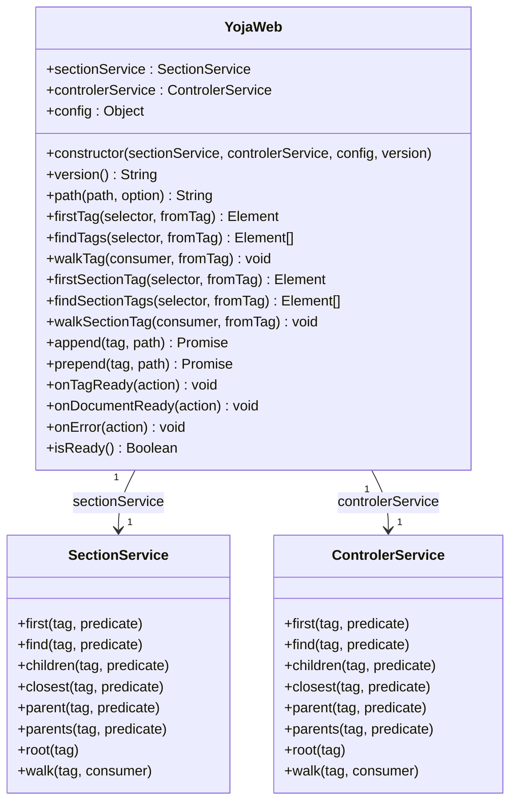
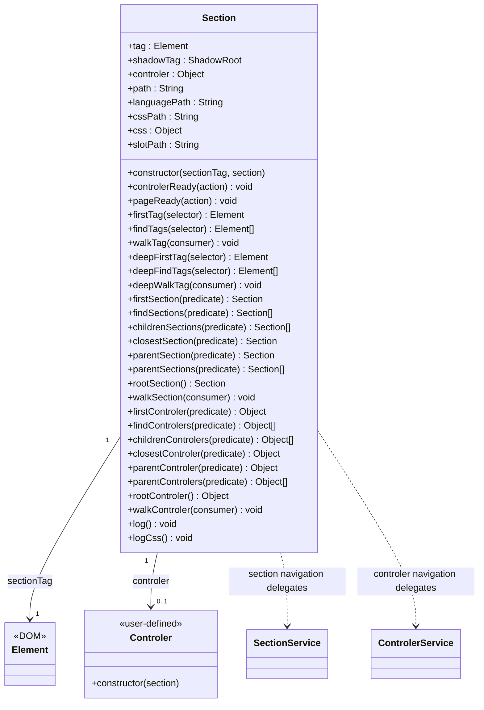

# yoja-web

[](https://easygoingapi.com/modules/web.html) [](mailto:easy.api.contact@gmail.com)

[](https://github.com/Easy-API-Style/yoja-framework/releases/tag/1.0.0)
[](https://github.com/Easy-API-Style/yoja-framework/blob/main/LICENSE)
[](https://central.sonatype.com/artifact/com.easygoingapi/yoja-web/1.0.0)

**JavaScript / CSS / HTML** frontend framework for the Yoja full-stack suite (backend in pure Java). Follows the **React component pattern** — each section of the page is bound to an ES6 controller class — but with no virtual DOM, no build step, and no transpiler. Provides section-based component architecture, routing, i18n, HTTP, WebSocket, and storage utilities built entirely on native ES6 modules.

---

## Why yoja-web?

Modern frameworks like React, Vue, and Angular are powerful, but they come with significant trade-offs. yoja-web takes a different approach — it is built entirely on **native browser APIs**, with no virtual DOM, no transpilation step, and no build tool required.

### Zero build toolchain

| | React / Vue / Angular | yoja-web |
|---|---|---|
| Build step | Required (Webpack, Vite, esbuild…) | None |
| Transpilation | Required (Babel, TypeScript…) | None |
| `node_modules` | Required (hundreds of MB) | None |
| Runtime overhead | Virtual DOM diffing | Direct DOM manipulation |
| Browser delivery | Bundled JS (one large file) | Native ES6 modules, loaded on demand |

yoja-web files are served directly by any static HTTP server. No `npm install`, no `package.json`, no bundler configuration.

### Native ES6 modules — no magic

Controllers are plain ES6 classes loaded with native dynamic `import()`. There is no JSX, no template compiler, no proprietary syntax to learn. Any JavaScript you write runs as-is in the browser.

```js
// A complete controller — plain ES6, no framework imports needed
export default class CardControler {
    constructor(section) {
        section.pageReady(() => {
            section.firstTag('h2').textContent = 'Hello';
        });
    }
}
```

### Native Shadow DOM — CSS scoping without a build step

React and Vue scope CSS at build time by generating unique class-name hashes (CSS Modules, `scoped` attribute). yoja-web uses the **browser's native Shadow DOM** instead: each section is a shadow root, and its CSS is attached via `adoptedStyleSheets`. Styles are physically isolated by the browser — no generated class names, no post-processing.

**CSS Flexbox works seamlessly with yoja-web.** Because each section is a real DOM element (`<div>` by default), you can apply `display: flex`, `flex-direction`, `gap`, and all other flex properties directly on the section container or any element inside it — exactly as you would in plain HTML/CSS, with full browser support and no interference from the framework.

### True HTML-first architecture

In React or Vue the HTML is generated from JavaScript (JSX or template functions). In yoja-web the HTML is always the source of truth. Sections are declared directly in `.html` files using attributes:

```html
<div yw-controler="./CardControler.js"
     yw-css="./card.css"
     yw-language="./i18n/en.xml">
</div>
```

**HTML, CSS, and JavaScript are strictly separated.** Each lives in its own file with a single responsibility: `.html` defines the structure, `.css` defines the appearance, `.js` defines the behaviour. There is no JSX mixing markup with logic, no `<style>` blocks inside components, no CSS-in-JS. This clean separation makes each file easier to read, maintain, and hand off between developers and designers.

Designers can work on HTML and CSS without touching JavaScript. Controllers are added progressively only where behaviour is needed.

### Gradual adoption

Because there is no build step and no global state management layer, yoja-web can be dropped into an existing HTML page section by section. You do not need to rewrite an entire application to start using it.

### Comparison summary

| Feature | React | Vue | Angular | yoja-web |
|---|---|---|---|---|
| Build step required | Yes | Yes | Yes | No |
| Virtual DOM | Yes | Yes | No | No |
| CSS scoping | Build-time (CSS Modules) | Build-time (`scoped`) | Build-time (Emulated) | Runtime (Shadow DOM) |
| Native ES6 modules | No (bundled) | No (bundled) | No (bundled) | Yes |
| Learning curve | Medium | Low–Medium | High | Low |
| Bundle size | ~40 kB (React+DOM) | ~33 kB | ~130 kB | ~50 kB (one JS file) |
| External dependencies | Many | Many | Many | None |
| i18n built-in | No | No (plugin) | Yes | Yes |
| HTTP client built-in | No | No | Yes (HttpClient) | Yes |
| WebSocket built-in | No | No | No | Yes |
| Responsive service built-in | No | No | No | Yes |

---

## Installation

Include the framework script in your HTML. Point `yw-config-path` at a config file to enable runtime configuration (optional — see [Configuration](#yojaweb-configuration)):

```html
<script type="module"
        src="/com/easygoingapi/yoja/web/YojaWeb.js"
        yw-config-path="/YojaWeb.conf.js"></script>
```

---

## Table of Contents

- [YojaWeb Configuration](#yojaweb-configuration)
- [HTML Directives](#html-directives)
  - [yw-controler](#yw-controler)
  - [yw-language](#yw-language)
  - [yw-css](#yw-css)
  - [yw-slot](#yw-slot)
  - [yw-include](#yw-include)
- [yojaWeb — Global API](#yojaweb-global-api)
  - [Tag queries (crosses shadow DOM)](#tag-queries-crosses-shadow-dom)
  - [Section tag queries (shallow)](#section-tag-queries-shallow--stops-at-section-boundaries)
  - [Path resolution](#path-resolution)
  - [Dynamic append](#dynamic-append)
  - [Dynamic prepend](#dynamic-prepend)
  - [Lifecycle & errors](#lifecycle--errors)
- [Section — Component Lifecycle](#section-component-lifecycle)
  - [Tag Query Methods](#tag-query-methods)
  - [Section Navigation](#section-navigation)
  - [Controller Navigation](#controller-navigation)
  - [Lifecycle Hooks](#lifecycle-hooks)
  - [Logging](#logging)
- [yojaWebApi — Services Aggregator](#yojawebapi-services-aggregator)
  - [navigationService](#navigationservice)
  - [eventService](#eventservice)
  - [httpClient](#httpclient)
  - [storageService](#storageservice)
  - [webSocketService](#websocketservice)
  - [responsiveService](#responsiveservice)
  - [languageService](#languageservice)
  - [urlParameterService](#urlparameterservice)
  - [cssSheetService](#csssheetservice)
- [CSS and Shadow DOM](#css-and-shadow-dom)
  - [How it works](#how-it-works)
  - [Section-scoped CSS](#section-scoped-css)
  - [CSS inheritance between sections](#css-inheritance-between-sections)
  - [The :host() selector](#the-host-selector)
  - [CSS variables and theming](#css-variables-and-theming)
  - [Media queries in CSS](#media-queries-in-css)
  - [section.shadowTag](#section-shadowtag)
  - [Debugging CSS](#debugging-css)
- [Full Example](#full-example)
- [Dependencies](#dependencies)

---

## YojaWeb: Configuration

The config file is declared via the `yw-config-path` attribute on the `<script>` tag. The framework dynamically imports that path as an ES6 module and reads its `default` export.

```html
<script type="module"
        src="/com/easygoingapi/yoja/web/YojaWeb.js"
        yw-config-path="/YojaWeb.conf.js"></script>
```

```js
// /YojaWeb.conf.js
export default {
    // Appended as ?version=X to every HTML, CSS and JS resource loaded by the framework.
    // This is the cache-busting mechanism: bump this string on each new release of your
    // application and every browser will be forced to re-download the HTML pages, the
    // section CSS files and the controller JS files instead of serving stale copies from
    // its HTTP cache. Without this, users would keep running old assets after a deploy
    // until their cache expires naturally.
    version: '1.0.0',

    // Responsive breakpoints for responsiveService
    mediaDescriptions: [
        { name: 'mobile',  maxWidth: 767  },
        { name: 'tablet',  maxWidth: 1023 },
        { name: 'desktop'                 }
    ]
};
```

If `yw-config-path` is absent the framework starts with an empty config. If the file cannot be loaded a `console.warn` is emitted and the framework starts with an empty config.

> **About `version`** — this property is the only reliable way to invalidate the browser cache for HTML, CSS and JS after a deploy. The framework appends `?version=<value>` to every URL **it** loads (controllers, stylesheets, included HTML, language XML, slot templates), so any change to this string produces brand-new URLs and forces the browser to re-fetch them. Typical values: a semantic version (`'1.0.0'`), a build number, or a git commit hash injected at build time. The method that actually stamps `?version=<value>` on a URL is [`yojaWeb.path(...)`](#path-resolution) — the framework calls it internally for every URL it loads, and you must call it yourself for any URL you build from JavaScript.
>
---

## HTML Directives

A tag becomes a **section** — a managed component boundary — when it carries at least one of these four attributes: `yw-controler`, `yw-language`, `yw-css`, or `yw-slot`. The `yw-include` attribute is separate and does not create a section.

### yw-controler

Attaches a JavaScript controller class (ES6 module) to the element, making it a section.

```html
<div yw-controler="./MyControler.js"></div>
```

```js
// MyControler.js
export default class MyControler {
    constructor(section) {
        this.section = section;

        section.controlerReady(() => {
            // called after the controller is instantiated
            console.log('controller ready');
        });

        section.pageReady(() => {
            // called after the entire page is loaded
            console.log('page ready');
        });
    }
}
```

### yw-language

Declares the XML translation file for the section's i18n, making the element a section.

```html
<div yw-language="./i18n.xml"></div>
```

Can be combined with other directives:

```html
<div yw-controler="./AppControler.js" yw-language="./i18n.xml"></div>
```

### yw-css

Attaches a CSS file scoped to the section via adopted stylesheets, making the element a section.

```html
<!-- Single CSS file -->
<div yw-css="./style.css"></div>

<!-- Inherit parent section's CSS (empty value) -->
<div yw-controler="./MyControler.js" yw-css></div>
```

### yw-slot

Defines the HTML template file used as a slot for the section, making the element a section.

```html
<div yw-slot="./slot.html"></div>
```

### yw-include

Loads external HTML into the element. Does **not** create a section by itself.

```html
<!-- Default: outer mode — the host tag is replaced by the loaded HTML -->
<div yw-include="./header.html"></div>

<!-- inner mode — the host tag is kept, loaded HTML becomes its children -->
<div yw-include="./sidebar.html" yw-include-mode="inner"></div>
```

#### `yw-include-mode`

Controls how the loaded HTML is grafted onto the DOM. Two values are recognised; any other value (or omitting the attribute) falls back to `outer`.

| Value | Effect on the include host tag | Effect on the loaded HTML |
|---|---|---|
| `outer` *(default)* | Removed from the DOM after the include resolves | Its child nodes are inserted in place, as siblings where the host tag used to be |
| `inner` | Kept in the DOM | Becomes the `innerHTML` of the host tag (its children) |

**Why this matters.** In `outer` mode, the `<div yw-include="...">` wrapper is gone after loading — useful when the included file already provides its own root element (a `<section yw-controler="...">`, a `<header>`, …) and you do not want an extra wrapper in the final markup. In `inner` mode, the wrapper survives and you can target it from the parent's CSS, attach `id` / `class` / `data-*` attributes, or have JavaScript reach for it.

```html
<!-- outer: included file's root replaces the include tag -->
<!-- before: <div yw-include="./card.html"></div>           -->
<!-- after:  <section yw-controler="./CardControler.js">…</section> -->

<!-- inner: include tag survives, included root becomes its child -->
<!-- before: <div class="wrapper" yw-include="./card.html" yw-include-mode="inner"></div> -->
<!-- after:  <div class="wrapper"><section yw-controler="./CardControler.js">…</section></div> -->
```

The included file may itself contain section elements (with `yw-controler`, `yw-css`, etc.) — they are wired up by the framework after grafting, regardless of the mode.

**See it in action** in `yoja-blueprint-kanban`:
- [`index.html`](../yoja-blueprint-kanban/src/main/webapp/com/easygoingapi/yoja/example/webapp/index.html) — uses `<div yw-include="./sections/taskdetail/taskdetail.html"></div>` to pull in the full task-detail `<section>` from a separate file.
- [`taskdetail.html`](../yoja-blueprint-kanban/src/main/webapp/com/easygoingapi/yoja/example/webapp/sections/taskdetail/taskdetail.html) — the included file, which itself declares `yw-controler` / `yw-css` / `yw-language` with paths relative to its own location.

---

## yojaWeb: Global API

`window.yojaWeb` is the main framework object, available immediately after the script loads.



> The `sectionService`, `controlerService` and `config` properties are exposed as JS getters backed by hard-private fields (`#sectionService`, `#controlerService`, `#config`, `#version`). The internal helper `#addTag(mode, tag, path)` factors the shared logic between `append` and `prepend`.

```js
// Wait for the framework to finish loading
window.yojaWeb.onDocumentReady(() => {
    console.log('framework ready, version: ' + window.yojaWeb.version());
});
```

### Tag queries (crosses shadow DOM)

```js
// Find the first element matching a CSS selector (deep, crosses shadow roots)
const btn = window.yojaWeb.firstTag('button.submit');

// Find all matching elements (deep)
const inputs = window.yojaWeb.findTags('input[required]');

// Walk every element (deep)
window.yojaWeb.walkTag(tag => {
    console.log(tag.localName);
});

// Scope to a specific root tag
const label = window.yojaWeb.firstTag('label', myRootTag);
```

### Section tag queries (shallow — stops at section boundaries)

```js
// Find within section boundaries only
const first = window.yojaWeb.firstSectionTag('[yw-controler]');
const all   = window.yojaWeb.findSectionTags('[yw-css]');
window.yojaWeb.walkSectionTag(tag => console.log(tag));
```

### Path resolution

```js
// Resolve a path — appends ?version=X from config
const url = window.yojaWeb.path('./MyControler.js');
// → "./MyControler.js?version=1.0.0"

// Force cache-bust with current timestamp
const fresh = window.yojaWeb.path('./data.json', { force: true });
// → "./data.json?version=1.0.0&date=1712345678901"

// Add the framework's API version
const api = window.yojaWeb.path('./lib.js', { apiVersion: true });
```

#### ⚠️ Why you must wrap relative paths in `import.meta.resolve(...)`

> Two worlds coexist for path resolution in yoja-web:
>
> **1. HTML directives — the framework anchors for you.**
> For `yw-controler`, `yw-css`, `yw-language`, `yw-include`, `yw-slot`, the framework parses the HTML, so it knows which file declared the directive. Internally it calls `formatPathFrom(path, fromPath)` to anchor the relative path against the **parent file's URL**. You write `./HeaderControler.js` next to `header.html` and it Just Works regardless of the document URL.
>
> **2. JS-call APIs — the framework only sees a string.**
> `yojaWeb.append`, `yojaWeb.prepend`, `httpClient.get/post/...` receive a path argument with no way to recover the calling module. They need an already-absolute URL.
>
> **The browser trap.** These APIs ultimately call `fetch()`. `fetch('./foo')` resolves `./foo` against `document.baseURI` — the **document URL**, not the URL of the JS module that made the call. A controller at `/sections/foo/FooControler.js` calling `fetch('./bar')` while the page sits at `/dashboard` ends up hitting `/bar`, never `/sections/foo/bar`. The same trap applies to `new URL('./foo')` (without a `base` argument) and `new Worker('./foo.js')`.
>
> **Not affected:** `import('./foo.js')` — both static and dynamic — resolves against the importing module's URL by spec, so no wrapping is needed for ES module imports.
>
> **`import.meta.resolve(spec)` is the standard ESM escape hatch.** Every ES module exposes its own URL via `import.meta.url`, and `import.meta.resolve(spec)` returns an absolute URL by resolving `spec` against that URL — anchored to the **module that wrote the call**, which is exactly what you want.
>
> **Recommended pattern** for any relative path passed to a yojaWeb JS API:
>
> ```js
> // In ./sections/foo/FooControler.js
> yojaWeb.prepend(
>     target,
>     import.meta.resolve(yojaWeb.path('./bar.html'))
> );
> //   ^^^^^^^^^^^^^^^^^^                    
> //   anchors to FooControler.js    
> //                      ^^^^^^^^^^^^^        
> //                      adds ?version=…
> ```
>
> The two helpers compose: `yojaWeb.path` adds the cache-busting query string (it does **not** anchor), then `import.meta.resolve` anchors the result to the calling module. Order matters — `path` first, `import.meta.resolve` outermost.
>
> **Where to apply it** — any yojaWeb JS API that takes a path string and bottoms out in `fetch`:
> - `yojaWeb.append(tag, path)`
> - `yojaWeb.prepend(tag, path)`
> - `httpClient.get({url: path, ...})` and the other HTTP verbs
> - any helper of yours that ends up in `fetch` / `XHR` / `new URL`
>
> **Where it is unnecessary:**
> - absolute paths (`'/partials/foo.html'`) or full URLs
> - HTML directives — the framework anchors for you
> - `import('./foo.js')` (static or dynamic) — module-relative by spec
>
> **See it in action** in `yoja-blueprint-kanban`:
> - [`indexControler.js`](../yoja-blueprint-kanban/src/main/webapp/com/easygoingapi/yoja/example/webapp/indexControler.js) — wraps `yojaWeb.path('./sections/header/header.html')` for a `prepend` call.
> - [`LoginControler.js`](../yoja-blueprint-kanban/src/main/webapp/com/easygoingapi/yoja/example/webapp/sections/login/LoginControler.js) — wraps `yojaWeb.path('./login.xml')` for a language-file load.

### Dynamic append

Loads an HTML file and appends its content to a DOM element, then applies framework directives on the new nodes.

```js
window.yojaWeb.append(document.getElementById('container'), '/partials/card.html')
              .then(children => console.log('appended', children.length, 'nodes'))
              .catch(err => console.error(err));
```

### Dynamic prepend

Same as `append`, but inserts the loaded content at the **beginning** of the target element (before any existing children). Framework directives are applied on the new nodes.

```js
window.yojaWeb.prepend(document.body, '/partials/header.html')
              .then(children => console.log('prepended', children.length, 'nodes'))
              .catch(err => console.error(err));
```

If the target has a shadow root, both `append` and `prepend` insert into that shadow root rather than the host element.

**See it in action** in `yoja-blueprint-kanban`: [`indexControler.js`](../yoja-blueprint-kanban/src/main/webapp/com/easygoingapi/yoja/example/webapp/indexControler.js) injects the `<header>` at the top of `<body>` via `yojaWeb.prepend(...)` (with `import.meta.resolve` — see [Why you must wrap relative paths in `import.meta.resolve(...)`](#path-resolution).

### Lifecycle & errors

```js
// Run after all sections on the page are ready
window.yojaWeb.onDocumentReady(() => {
    console.log('all sections ready');
});

// Run each time a section tag becomes ready
window.yojaWeb.onTagReady(section => {
    console.log('section ready:', section.tag.localName);
});

// Check readiness synchronously
if (window.yojaWeb.isReady()) {
    // framework is fully loaded
}

// Global error handler
window.yojaWeb.onError(error => {
    console.error('yoja error', error);
});
```

---

## Section: Component Lifecycle

A `Section` object is passed to every controller constructor. It exposes tag queries, section navigation, and lifecycle hooks scoped to the section.

```js
export default class MyControler {
    constructor(section) {
        this.section = section;

        section.pageReady(() => {
            const title = section.firstTag('h1');
            title.textContent = 'Hello';
        });
    }
}
```

### Where the class lives and what it's for

The class is defined in [`YojaWeb.js`](src/main/webapp/com/easygoingapi/yoja/web/YojaWeb.js) (search for `class Section`). It is **not exported** as a public symbol — you never construct one yourself. The framework instantiates a `Section` for every DOM element that carries at least one section-creating directive (`yw-controler`, `yw-css`, `yw-language`, or `yw-slot`), and hands it to your controller's constructor as the single argument.

A `Section` is the runtime façade of a component:

- **Identity** — it wraps the section's host tag (`section.tag`) and its shadow root if any (`section.shadowTag`), plus the resolved paths the framework loaded for it (`section.path`, `section.languagePath`, `section.cssPath`, `section.slotPath`).
- **Lifecycle** — `section.controlerReady(action)` runs once the controller of *this* section is constructed; `section.pageReady(action)` runs once *all* sections on the page are ready. This is the canonical place to register listeners, inject content, or read i18n strings.
- **Scoped DOM access** — `firstTag` / `findTags` / `walkTag` (shallow, stop at nested section boundaries) and their `deepXxx` counterparts (cross shadow roots) keep your DOM queries inside the boundary so a parent section never accidentally reaches into a child's internals.
- **Tree navigation** — `firstSection` / `findSections` / `parentSection` / `rootSection` / `walkSection` / … and the `xxxControler` mirrors give you a tree-walk API over the section graph and the controller graph respectively. Internally these delegate to the framework's `SectionService` and `ControlerService` (visible in the [YojaWeb class diagram above](#yojaweb-global-api)).
- **Diagnostics** — `section.log()` prints the section subtree (paths, ids, css inheritance) and `section.logCss()` prints the resolved CSS chain.



> The constructor's second parameter is the **section descriptor** built by the framework when it walks the DOM — an object holding `fromPath`, `languagePath`, `css` (with `rootPath` and `sheetEntities`), `slot.path`, and `controler.service` (the controller class). You never construct a `Section` yourself; the framework does it after resolving the directives.
>
> The `path`, `languagePath`, `cssPath` and `slotPath` getters return values from hard-private fields (`#path`, `#languagePath`, `#cssPath`, `#slotPath`) that the constructor freezes once from the section descriptor and normalizes via `jsUtil.onlyUrlPath(...)` — the same call that strips the `?version=…` cache-busting query string. They are read-only snapshots of *what the framework loaded for this section*, not delegations to `yojaWeb`: `path` is the URL of the file that declared the section (its `fromPath`), `languagePath` / `cssPath` / `slotPath` are the resolved URLs of the section's `yw-language`, `yw-css` (root) and `yw-slot` files respectively. Use [`yojaWeb.path(...)`](#path-resolution) when you need to *build* a URL from a relative spec; use these getters when you need to know *which file* a section came from.
>
> The `css` getter returns the raw `{ rootPath, sheetEntities }` pair the framework loaded — `sheetEntities` is the list of `CSSStyleSheet`s actually attached to the section's shadow root via `adoptedStyleSheets`. This is what `cssSheetService.walkCssSheet(...)` / `walkCssRule(...)` iterate over, and what `section.logCss()` formats for display.
>
> The `Controler` box is your own class (the one you point to from `yw-controler="…"`); the framework instantiates it with `new ControlerClass(this)` from inside the `Section` constructor, passing the freshly-built `Section` as the only argument.

**See it in action** in `yoja-blueprint-kanban`: every controller (e.g. [`TaskBoardControler.js`](../yoja-blueprint-kanban/src/main/webapp/com/easygoingapi/yoja/example/webapp/sections/taskboard/TaskBoardControler.js), [`HeaderControler.js`](../yoja-blueprint-kanban/src/main/webapp/com/easygoingapi/yoja/example/webapp/sections/header/HeaderControler.js)) receives a `Section` as its constructor argument and uses `section.pageReady(...)`, `section.firstTag(...)`, etc.

### Tag Query Methods

Methods that query DOM elements **within** the section (stops at nested section boundaries unless `deep` variant is used).

| Method | Description |
|---|---|
| `section.firstTag(selector)` | First matching element (shallow) |
| `section.findTags(selector)` | All matching elements (shallow) |
| `section.walkTag(consumer)` | Walk all elements (shallow) |
| `section.deepFirstTag(selector)` | First matching element (deep, crosses shadow roots) |
| `section.deepFindTags(selector)` | All matching elements (deep) |
| `section.deepWalkTag(consumer)` | Walk all elements (deep) |

```js
section.pageReady(() => {
    // Shallow — won't cross into nested section elements
    const btn = section.firstTag('button');

    // Deep — crosses shadow DOM and nested sections
    const allLinks = section.deepFindTags('a[href]');

    // Walk with early exit
    section.deepWalkTag(tag => {
        if (tag.matches('input')) {
            tag.disabled = true;
        }
    });
});
```

### Section Navigation

Methods to find `Section` objects relative to the current section.

| Method | Description |
|---|---|
| `section.firstSection(predicate?)` | First descendant section matching predicate |
| `section.findSections(predicate?)` | All descendant sections |
| `section.childrenSections(predicate?)` | Direct child sections only |
| `section.closestSection(predicate?)` | Nearest ancestor section |
| `section.parentSection(predicate?)` | First matching parent section |
| `section.parentSections(predicate?)` | All ancestor sections |
| `section.rootSection()` | The topmost ancestor section |
| `section.walkSection(consumer)` | Walk descendant sections |

The `predicate` is optional and can be a `Function(section) => boolean` or omitted to match all.

```js
// Find the first child section whose tag has class "active"
const active = section.firstSection(s => s.tag.classList.contains('active'));

// Get all ancestor sections
const parents = section.parentSections();

// Walk every nested section
section.walkSection((s, info) => {
    console.log('deep:', info.deep, 'index:', info.index);
    // return false to stop
});
```

### Controller Navigation

Same traversal methods but return the **controller** instance attached to each section.

| Method | Description |
|---|---|
| `section.firstControler(predicate?)` | First descendant controller |
| `section.findControlers(predicate?)` | All descendant controllers |
| `section.childrenControlers(predicate?)` | Direct child controllers |
| `section.closestControler(predicate?)` | Nearest ancestor controller |
| `section.parentControler(predicate?)` | First matching parent controller |
| `section.parentControlers(predicate?)` | All ancestor controllers |
| `section.rootControler()` | Topmost ancestor controller |
| `section.walkControler(consumer)` | Walk descendant controllers |

```js
// Find a sibling controller by class name
const header = section.closestControler(c => c.className() === 'HeaderControler');
header.setTitle('Welcome');
```

### Lifecycle Hooks

```js
export default class MyControler {
    constructor(section) {
        // Runs right after this controller is constructed
        section.controlerReady(() => {
            console.log('controller ready — other sections may still be loading');
        });

        // Runs after every section on the page has loaded
        section.pageReady(() => {
            console.log('full page ready');
        });
    }
}
```

### Section Properties

```js
section.tag          // The raw HTMLElement for this section
section.shadowTag    // The ShadowRoot (if present)
section.path         // Path helper (same as window.yojaWeb.path)
section.languagePath // Path to the section's XML translation file
section.cssPath      // Path to the section's CSS file
section.slotPath     // Path to the section's slot template
section.controler    // The controller instance attached to this section
```

### Logging

```js
// Print section tree to console
section.log();

// Print CSS cascade info for this section
section.logCss();
```

---

## yojaWebApi: Services Aggregator

`window.yojaWebApi` groups all services for convenience.

```js
const {
    sectionService,
    controlerService,
    eventService,
    httpClient,
    languageService,
    navigationService,
    responsiveService,
    storageService,
    urlParameterService,
    webSocketService,
    cssSheetService
} = window.yojaWebApi;
```

Each service is also available as a named ES6 module import within controllers.

### navigationService

Page navigation and URL introspection.

```js
const nav = window.yojaWebApi.navigationService;
```

```js
// Navigate to a path (SPA navigation)
nav.load('/dashboard');

// Reload the current page
nav.reload();

// Browser history
nav.back();
nav.forward();
nav.go(N); // go N steps in history

// Current URL parts
nav.path();      // → "/dashboard"
nav.fragment();  // → "section-1"
nav.host();      // → "example.com"
nav.port();      // → "8080" or ""

// Access a URL query parameter
nav.urlParameter('tab'); // → "settings"
```

---

### eventService

Pub/sub event system with query-based filtering.

```js
const events = window.yojaWebApi.eventService;
```

#### Subscribe

```js
// Listen for an exact event name
events.on('user:login', data => {
    console.log('logged in:', data);
});

// Listen with a regex
events.on(/^user:/, data => {
    console.log('any user event:', data);
});

// Listen with a query object
events.on({ startsWith: 'cart:' }, data => {
    console.log('cart event:', data);
});
// Query operators: startsWith, endsWith, contains, equals, matches (RegExp)
```

#### Publish

```js
events.trigger('user:login', { userId: 42 });
```

#### Manage listeners

```js
// Pause (suppress) all triggers for an event
events.pause('user:login');

// Re-activate
events.activate('user:login');

// Remove all listeners for an event
events.remove('user:login');

// Check if any listener exists
events.has('user:login'); // → true

// Inspect registered events
events.events();                  // all event names
events.event('user:login');       // listener count for one event
events.actions('user:login');     // array of listener functions
events.count();                   // total event count
events.countAction('user:login'); // action count for one event
```

---

### httpClient

`fetch` wrapper with automatic content-type detection, offline mode, and request/response interceptors.

```js
const http = window.yojaWebApi.httpClient;
```

#### GET

```js
// Simple GET — returns { status, body, headers }
const res = await http.get({ url: '/api/users' });
if (res.status === 200) {
    console.log(res.body); // auto-parsed based on response Content-Type
}

// GET with query parameters
const res = await http.get({ url: '/api/users', parameters: { page: 1, size: 20 } });
```

#### `fetchAs` — force response parsing mode

By default the response body is parsed according to the `Content-Type` header returned by the server. Use `fetchAs` to override this and force a specific parsing mode regardless of the server's header.

| `fetchAs` value | What the server must return | received `res.body` |
|---|---|---|
| `'json'` | JSON text | JS object or array (via `response.json()`) |
| `'text'` | Plain text, HTML, XML… | `string` (via `response.text()`) |
| `'blob'` | **base64**-encoded string | `Blob` (decoded from base64) |
| `'base64'` | **base64**-encoded string | `ArrayBuffer` (decoded from base64, Content-Type updated from the MIME type detected in the blob) |
| `'arrayBuffer'` | Raw binary (no base64) | `ArrayBuffer` (via `response.arrayBuffer()`, Content-Type forced to `application/octet-stream` if absent) |

> **`'blob'` and `'base64'`** expect the server to return a **base64-encoded** string in the response body (not raw binary). The client then decodes that string.
> **`'arrayBuffer'`** reads the response body as **raw binary** directly, without any base64 decoding.

If `fetchAs` is absent, the mode is inferred from the response `Content-Type` header (see [Custom content types](#custom-content-types)). Falls back to `'arrayBuffer'` for unrecognised types.

```js
// Force text parsing regardless of Content-Type
const res = await http.get({ url: '/partials/card.html', fetchAs: 'text' });
console.log(res.body); // raw HTML string

// Force JSON parsing
const res = await http.get({ url: '/api/data', fetchAs: 'json' });
console.log(res.body); // JS object

// Retrieve raw binary (image, PDF…)
const res = await http.get({ url: '/api/image.png', fetchAs: 'arrayBuffer' });
console.log(res.body); // ArrayBuffer

// Server returns a base64 string → get a Blob
const res = await http.get({ url: '/api/file', fetchAs: 'blob' });
console.log(res.body); // Blob (e.g. new Blob([...], { type: 'application/pdf' }))

// Server returns a base64 string → get an ArrayBuffer
const res = await http.get({ url: '/api/file', fetchAs: 'base64' });
console.log(res.body);        // ArrayBuffer
console.log(res.headers.get('content-type')); // MIME type detected from the decoded blob
```

`fetchAs` works the same way for POST responses:

```js
const res = await http.post({ url: '/api/render', fetchAs: 'text' }, { template: 'card' });
console.log(res.body); // raw HTML string
```

#### POST

The body is passed as the **second argument**, separate from the request object.

```js
// post(request, body) → { status, body, headers }
const res = await http.post({ url: '/api/users' }, { name: 'Alice' });
```

##### Automatic `Content-Type` detection

When `contentType` is not specified, the body type is inferred automatically before sending:

| Body value | `Content-Type` sent |
|---|---|
| `Blob` | `application/blob` (serialised as base64) |
| Array | `application/array-json` |
| Object | `application/json` |
| `String` / `Number` / `Date` | `text/plain` |

```js
// Object → application/json
await http.post({ url: '/api/users' }, { name: 'Alice' });

// Array → application/array-json
await http.post({ url: '/api/tags' }, ['java', 'vertx']);

// String → text/plain
await http.post({ url: '/api/log' }, 'plain text message');

// Blob → application/blob (serialised as base64)
await http.post({ url: '/api/upload' }, new Blob([data]));
```

##### `contentType` — override the request Content-Type

Add `contentType` to the request object to force a specific MIME type instead of the auto-detected one. The body is still serialised with `JSON.stringify` (or kept as-is for `Blob`).

```js
await http.post(
    { url: '/api/data', contentType: 'application/xml' },
    '<item><name>Alice</name></item>'
);

// With extra headers
await http.post(
    { url: '/api/users', contentType: 'application/json', headers: { 'X-Request-Id': '123' } },
    { name: 'Alice' }
);
```

#### load / fetch

```js
// load — always fetches as text, returns body string directly
const html = await http.load('/partials/card.html');

// fetch — returns the raw browser Response object
const response = await http.fetch('/api/data');
```

#### Interceptors

```js
// Modify every outgoing request
http.onRequest(request => {
    request.headers = request.headers || {};
    request.headers['Authorization'] = 'Bearer ' + getToken();
});

// Inspect every response
http.onResponse((request, response) => {
    if (response.status === 401) {
        nav.load('/login');
    }
});
```

#### Offline handling

When the browser is offline all requests immediately return `{ status: 470 }` without hitting the network.

```js
if (http.isOffline()) {
    console.warn('No network — requests will return status 470');
}

http.onOnline(() => console.log('back online'));
http.onOffline(() => console.warn('gone offline'));
```

#### Custom content types

`addContentTypes` extends the mapping from response `Content-Type` header to `fetchAs` parsing mode. It accepts an object with up to four arrays of MIME type strings:

```js
http.addContentTypes({
    jsonContentTypes:   ['application/vnd.api+json'],  // parse as JSON
    textContentTypes:   ['application/graphql'],        // parse as text
    blobContentTypes:   ['application/pdf'],            // decode base64 → Blob
    base64ContentTypes: ['application/octet-stream'],   // decode base64 → ArrayBuffer
});
```

These same keys can also be declared in the config file pointed to by `yw-config-path`, so you can configure them globally without calling `addContentTypes` at runtime:

```js
// /YojaWeb.conf.js
export default {
    version: '1.0.0',
    jsonContentTypes:   ['application/vnd.api+json'],
    textContentTypes:   ['application/graphql'],
    blobContentTypes:   ['application/pdf'],
    base64ContentTypes: ['application/octet-stream'],
};
```

Default mappings (always active):

| Parsing mode | Built-in MIME types |
|---|---|
| `json` | `application/json`, `application/array-json` |
| `text` | `text/plain`, `text/html`, `text/css`, `application/xml`, `application/javascript` |
| `blob` | `application/blob` |
| `base64` | `application/base64` |
| `arrayBuffer` | *(fallback for all other types)* |

---

### storageService

Typed `localStorage` / `sessionStorage` wrapper with change events. Item keys are namespaced with the prefix `yojaWebItemKey__`; the per-scope index of keys is kept under `yojaWebItemKeys__local` / `yojaWebItemKeys__session`.

```js
const storage = window.yojaWebApi.storageService;
```

#### Storable values

Values are JSON-serialized with a small type tag, so the stored type is restored on read:

| Stored value | Restored as |
| --- | --- |
| `Date` | a `Date` instance (revived from ISO) |
| plain object / array | the same structure (deep, JSON copy) |
| primitive — `string` / `number` / `boolean` / `null` | the same primitive |
| `undefined` | stored as `null` |

Caveats — values must be JSON-serializable:

- Non-serializable values (`function`, `Map`, `Set`, `Symbol`, class instances) are dropped or flattened to `{}` by `JSON.stringify`.
- A `Date` is only revived when it is the **top-level** value. A `Date` nested inside an object/array comes back as its ISO **string**, not a `Date`.

#### Local storage

```js
storage.setLocalItem('theme', 'dark');
const theme = storage.getLocalItem('theme');  // → "dark"
storage.removeLocalItem('theme');
storage.clearLocal();
storage.getLocalItemKeys();    // → ["theme", ...]
storage.hasLocalItem('theme'); // → false
```

#### Session storage

```js
storage.setSessionItem('token', 'eyJ...');
const token = storage.getSessionItem('token');
storage.removeSessionItem('token');
storage.clearSession();
storage.getSessionItemKeys();
storage.hasSessionItem('token');
```

#### Change events

Two subscription styles. `on(...)` targets one `scope` + `method` + `key`; the callback receives **only the value**. The recognised methods are `get`, `set`, `has`, `remove`.

```js
// scope: 'local' | 'session' ; method: 'get' | 'set' | 'has' | 'remove'
storage.on('local', 'set', 'theme', value => {
    console.log('theme changed to', value);
});

storage.on('session', 'remove', 'token', value => {
    console.log('token removed, was', value);
});
```

`onEvent(...)` is a global listener fired for every change. The callback receives **positional arguments** `(scope, method, key, value)` — not an object. Methods seen here also include `clear`.

```js
storage.onEvent((scope, method, key, value) => {
    console.log(scope, method, key, value);
    // e.g. 'local' 'set' 'theme' 'dark'
});
```

> `clear` (from `clearLocal()` / `clearSession()`) is delivered to `onEvent` as `(scope, 'clear')` only — `key` and `value` are `undefined`. `clear` is **not** a valid `method` for the per-key `on(...)`, and clearing does not fire per-key `remove` handlers.

---

### webSocketService

WebSocket wrapper with state management and event hooks.

```js
const ws = window.yojaWebApi.webSocketService;
```

```js
// Open a connection (auto-detects wss:// or ws:// from page protocol)
const socket = ws.webSocket('/api/ws/chat');

// Send a message
ws.send(socket, { type: 'chat', text: 'Hello' });

// Close
ws.close(socket);

// Event hooks
ws.onOpen(socket, event => {
    console.log('connected');
});

ws.onMessage(socket, message => {
    const data = JSON.parse(message.data);
    console.log('received:', data);
});

ws.onClose(socket, event => {
    console.log('closed, code:', event.code);
});

ws.onError(socket, error => {
    console.error('ws error', error);
});

// Generic event hook
ws.on(socket, 'message', handler);
```

Connection timeout is 5 seconds. If the server does not respond within that window, the socket is closed.

---

### responsiveService

Media-query breakpoints and resize callbacks. Breakpoints are configured via `mediaDescriptions` in the config file pointed to by `yw-config-path`. Each entry has a `name` and an optional `maxWidth` (pixels). The last entry without `maxWidth` matches everything above the previous breakpoint.

```js
const responsive = window.yojaWebApi.responsiveService;
```

```js
// Get the currently active media name
const media = responsive.getMedia(); // → "desktop"

// Find a media descriptor by name
const descriptor = responsive.findMedia('tablet');
console.log(descriptor.maxWidth); // → 1023

// List all registered media names
const list = responsive.getListOfMedia(); // → ["mobile", "tablet", "desktop"]

// React to media changes
responsive.onMedia(media => {
    console.log('media changed to:', media); // → "mobile"
});

// React to any resize event
responsive.onResize(event => {
    console.log('resized:', window.innerWidth);
});
```

#### Example in a controller

```js
export default class AppControler {
    constructor(section) {
        const responsive = yojaWebApi.responsiveService;

        responsive.onMedia(media => {
            section.tag.dataset.media = media; // → "mobile" | "tablet" | "desktop"
        });
    }
}
```

```css
/* app.css — adapt layout per breakpoint using the data-media attribute */
:host([data-media="mobile"])  { flex-direction: column; }
:host([data-media="tablet"])  { flex-direction: row; gap: 12px; }
:host([data-media="desktop"]) { flex-direction: row; gap: 24px; }
```

---

### languageService

Internationalisation with XML translation files and `yw-i18n` HTML attributes.

```js
const lang = window.yojaWebApi.languageService;
```

#### HTML attributes

```html
<!-- Translate element text content -->
<p yw-i18n="welcome.message"></p>

<!-- Translate an attribute -->
<input yw-i18n-placeholder="form.name.placeholder" />

```

#### XML translation file

```xml
<!-- en/messages.xml -->
<messages>
    <message key="welcome.message">Welcome to the app</message>
    <message key="form.name.placeholder">Your name</message>
    <message key="image.description">Application logo</message>
</messages>
```

#### API

```js
// Change the active language
lang.setLanguage('fr');

// Get the current language code
lang.getLanguage(); // → "en"

// React to language changes
lang.onLanguageChange(code => {
    console.log('language is now:', code);
});

// Re-apply translations to the whole page
lang.refresh();

// Re-apply translations from a specific root element
lang.refreshFrom(document.getElementById('app'));

// React after translations are applied
lang.onLanguageTranslate(() => {
    console.log('translations applied');
});

// Dynamically load a translator for a section
lang.loadTranslator(section);

// Log all loaded translations
lang.log();
```

---

### urlParameterService

URL query parameter management backed by the browser History API. Mutations
(`set` / `append` / `remove` / `clear` / `setHash`) update an **in-memory** model;
the URL itself only changes when you call `push()` or `replace()`.

```js
const params = window.yojaWebApi.urlParameterService;
```

#### Read

```js
params.has('tab');             // → true
params.has('tag', 'java');     // → true (key + specific value)
params.keys();                 // → ["tab", "tag"]
params.get('tab');             // → "settings"
params.getAll('tag');          // → ["java", "vertx"]
params.entries();              // → [{key: "tab", value: "settings"}, {key: "tag", value: "java"}, ...]
params.toUrlQuery();           // → "tab=settings&tag=java"
params.currentUrlParameter();  // → UrlParameter (fresh snapshot from the live URL)
```

#### Write (in-memory until push/replace)

```js
params.set('tab', 'profile');    // set — replaces existing values for the key
params.append('tag', 'gradle');  // add — keeps existing values
params.remove('tab');            // remove a key (or remove(key, value) for one value)
params.clear();                  // remove all params (also clears the hash)
```

#### Hash (fragment)

```js
params.setHash('section-2');     // stored without the leading '#'
params.getHash();                // → "section-2"   (in-memory value)
params.currentUrlHash();         // → cleaned live window.location.hash
params.removeHash();             // clear the stored hash
```

#### History control

```js
// Commit the in-memory params + hash to the URL:
params.replace();                // replace the current history entry (no new back step)
params.push();                   // push a new history entry

// Attach a state payload, retrievable later via state():
params.push({ from: 'search' });
params.state();                  // → current window.history.state (getter, no argument)

// Native navigation:
params.back();
params.forward();
params.go(-2);                   // integer delta only; non-integers are ignored
```

#### Change events

`onChange` fires with an **event object** describing what happened. Returning
`false` from a `before-*` event **cancels** the operation (navigation guard).

```js
params.onChange(event => {
    switch (event.event) {
        case 'set':
        case 'append':
        case 'remove':
            console.log('param changed:', params.toUrlQuery());
            break;
        case 'before-push':
            if (!allowed) return false;   // veto the push
            break;
        case 'pop':                       // browser back / forward
            console.log('navigated:', params.toUrlQuery());
            break;
    }
});

// → true when the live URL is in sync with the in-memory params + hash
//   (i.e. nothing left to push/replace)
params.isUpdated();
```

Possible `event.event` values:

```
clear | append | set | remove | set-hash | remove-hash
  | before-replace | after-replace | before-push | after-push | pop | load
```

---

### cssSheetService

Inspect and update CSS custom properties (`--var`) across all section adopted stylesheets.

```js
const css = window.yojaWebApi.cssSheetService;
```

```js
// Read a custom property from the first matching rule
const primary = css.getProperties('--color-primary');
// → "#3b82f6"

// Update a custom property across all sheets
css.updateProperties('--color-primary', '#ef4444');

// Walk all CSS sheets
css.walkCssSheet(sheet => {
    console.log(sheet.href);
});

// Walk all CSS rules in all sheets
css.walkCssRule(rule => {
    console.log(rule.cssText);
});
```

## CSS and Shadow DOM

### How it works

Every yoja section is automatically converted into a **Shadow DOM host** by the framework. As soon as an element carries at least one of the attributes `yw-controler`, `yw-language`, `yw-css`, or `yw-slot`, the framework:

1. Clears the element's content (`innerHTML`).
2. Creates a `ShadowRoot` in `open` mode via `attachShadow({ mode: 'open' })`.
3. Re-injects the HTML content into that shadow root.
4. Attaches the CSS to the shadow root via `adoptedStyleSheets`.

```
┌─ <div yw-css="./app.css" yw-controler="./AppControler.js">  ← shadow host
│   └─ #shadow-root (open)
│       ├─ <style> (adoptedStyleSheet → app.css)
│       └─ ... section HTML content
│           └─ <div yw-css="./card.css">  ← child section, nested shadow
│               └─ #shadow-root (open)
│                   ├─ <style> (adoptedStyleSheet → card.css)
│                   └─ ... child section HTML content
└─
```

> The `open` mode means the shadow root remains accessible from JavaScript via `element.shadowRoot`. This allows `section.deepFindTags()` and `domUtil` to transparently traverse shadow boundaries.

---

### Section-scoped CSS

The `yw-css` attribute points to a CSS file loaded via `CSSStyleSheet.replaceSync()` and attached to the section's shadow root via `adoptedStyleSheets`. The CSS is therefore **naturally encapsulated**: it does not leak into the rest of the document, and parent document styles do not bleed into the section.

```html
<!-- Styles from card.css only apply inside this shadow root -->
<div yw-css="./card.css" yw-controler="./CardControler.js"></div>
```

```css
/* card.css — fully isolated styles */
h2 { color: steelblue; }
p  { font-size: 0.9rem; }
```

An `h2` in another section **will not be affected** by this rule.

---

### CSS inheritance between sections

By default each section loads its own CSS file. A child section can however **inherit** the `adoptedStyleSheets` of its parent section by leaving the `yw-css` value empty:

```html
<!-- Parent section: loads its own CSS -->
<div yw-css="./parent.css" yw-controler="./ParentControler.js">

    <!-- Child section: inherits parent CSS, no file of its own -->
    <div yw-controler="./ChildControler.js" yw-css></div>

    <!-- Child section: has its own CSS (full isolation) -->
    <div yw-css="./child.css" yw-controler="./ChildControler.js"></div>

</div>
```

Resolution rules:

| `yw-css`            | CSS behaviour                                                   |
|---------------------|-----------------------------------------------------------------|
| `yw-css="./my.css"` | Loads `my.css` into a dedicated `adoptedStyleSheet`             |
| `yw-css` (empty)    | Reuses the parent section's `adoptedStyleSheets`                |
| Absent              | No shadow CSS — document styles apply normally                  |

---

### The `:host()` selector

Inside a shadow root, the host element itself cannot be targeted by standard CSS selectors. Use `:host()` to style it:

```css
/* Target the host by tag name */
:host(body) {
    margin: 10px;
    max-width: 600px;
}

:host(div) {
    display: flex;
    flex-flow: column nowrap;
    gap: 8px;
}

/* Target the host by class */
:host(.card) {
    border: 1px solid #ccc;
    border-radius: 4px;
    padding: 16px;
}
```

Without `:host()`, styles defined in a section's CSS file cannot apply to the section's root element itself.

---

### CSS variables and theming

**CSS custom properties** (`--my-variable`) cross shadow DOM boundaries by design, making them the natural mechanism for sharing a theme across all sections:

```css
/* root.css or global.css, loaded by the root section */
:root {
    --color-primary:   #3b82f6;
    --color-secondary: #64748b;
    --font-size-base:  1rem;
    --border-radius:   4px;
}
```

```css
/* card.css — child section, uses theme variables */
:host(div) {
    border: 1px solid var(--color-secondary);
    border-radius: var(--border-radius);
}

h2 {
    color: var(--color-primary);
    font-size: var(--font-size-base);
}
```

`cssSheetService` lets you update these variables at runtime across all shadow roots in one call:

```js
const css = window.yojaWebApi.cssSheetService;

// Read the current value
const primary = css.getProperties('--color-primary'); // → "#3b82f6"

// Update across all adopted stylesheets
css.updateProperties('--color-primary', '#ef4444');
```

---

### Media queries in CSS

The framework supports `@import` with a `media` condition directly in section CSS files. Stylesheets are then **swapped dynamically** when the media query changes (e.g. on window resize):

```css
/* main.css */
@import url("./layout-mobile.css")  screen and (max-width: 767px);
@import url("./layout-desktop.css") screen and (min-width: 768px);

:host(div) {
    /* shared styles */
}
```

Each conditional import produces a dedicated `adoptedStyleSheet` in the shadow root. The framework listens to `window.matchMedia` and swaps the active sheet automatically — no page reload required.

---

### section shadowTag

The `section.shadowTag` property exposes the section's `ShadowRoot` directly from the controller:

```js
export default class MyControler {
    constructor(section) {
        section.pageReady(() => {
            const shadow = section.shadowTag; // → ShadowRoot

            // Access the host element from the shadow root
            console.log(shadow.host);

            // Inspect the adopted stylesheets of this section
            for (const sheet of shadow.adoptedStyleSheets) {
                console.log(sheet.cssRules.length, 'CSS rules');
            }
        });
    }
}
```

| Property            | Type          | Description                                        |
|---------------------|---------------|----------------------------------------------------|
| `section.shadowTag` | `ShadowRoot`  | Shadow root of the section (mode `open`)           |
| `section.tag`       | `HTMLElement` | Host element in the main DOM                       |
| `section.cssPath`   | `string`      | Path to the section's CSS file                     |

---

### Debugging CSS

Two log methods are available from any controller:

```js
// Print the full section tree (hierarchy, shadow roots, controllers)
section.log();

// Print the CSS cascade for this section: loaded files, adopted stylesheets,
// resolved CSS variables, and the inheritance path from the parent section
section.logCss();
```

`section.logCss()` is especially useful for diagnosing why a style is not applied — it lists the active `adoptedStyleSheets` in the shadow root, their origin (own file or inherited), and any associated media queries.

---

## Full Example

The [`yoja-blueprint-kanban`](https://github.com/Easy-API-Style/yoja-blueprint-kanban) module is a complete task management application built with yoja-web and yoja-http-server. It demonstrates the full stack in one project: authentication, WebSocket real-time updates, URL parameter navigation, i18n, responsive layout, and end-to-end Selenium tests.

It is the recommended starting point to understand how all the pieces fit together in a real application.

---

## Dependencies

| Technology | Usage |
|---|---|
| Native ES6 modules | All imports are dynamic `import()` calls |
| Shadow DOM | CSS scoping via adopted stylesheets |
| History API | SPA navigation and URL parameter management |
| `fetch` | HTTP client |
| `WebSocket` | WebSocket service |
| `localStorage` / `sessionStorage` | Storage service |
| `DOMParser` | HTML and XML parsing |
| `matchMedia` | Responsive breakpoints |
